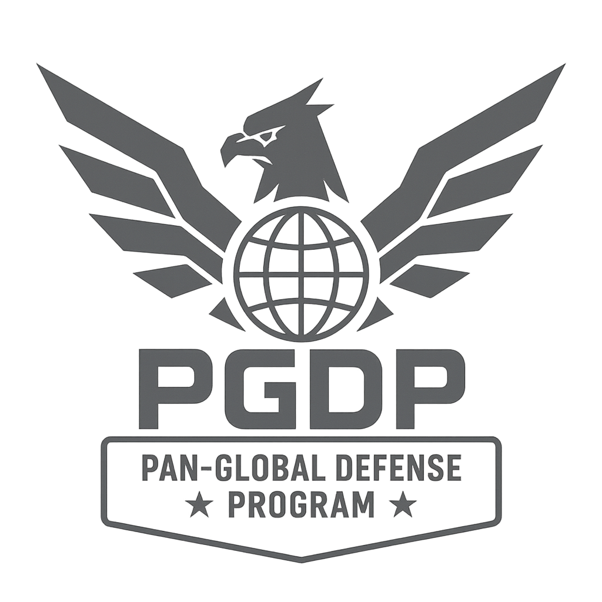

# 🌊 TITAN WATCH

<div align="center">



**Sistema Global de Monitoramento e Defesa contra Ameaças Kaiju**

[](LICENSE)
[](https://www.docker.com/)
[]()

[Documentação](docs/README.md) • [Roadmap](docs/ROADMAP.md) • [Arquitetura](docs/ARCHITECTURE.md)

</div>

---

## 📋 Sobre o Projeto

O **Titan Watch** é um sistema completo de microserviços para simular um programa global de defesa contra monstros gigantes (Kaiju), inspirado no universo de Pacific Rim.

### 🎯 Objetivos

- **Educacional**: Demonstrar diferentes arquiteturas de software e padrões de design
- **Experimental**: Testar e comparar diferentes tecnologias e abordagens
- **Portfolio**: Showcases de boas práticas de desenvolvimento
- **Divertido**: Tema interessante e envolvente para manter a motivação

### ✨ Funcionalidades Principais

- 🗺️ **Mapa Global Interativo** - Visualização em tempo real de ameaças e defesas
- 🤖 **Gestão de Jaegers** - CRUD completo de robôs gigantes
- 👾 **Monitoramento de Kaijus** - Rastreamento e análise de monstros
- 🏢 **Administração de Shatterdomes** - Gestão de bases de operação
- 📡 **Rastreamento em Tempo Real** - Sistema de tracking com dados temporais
- ⚡ **Sistema de Eventos** - Event Sourcing para auditoria completa
- 🔧 **Manutenção com Workflow** - Saga Pattern para processos complexos
- 📊 **Analytics Avançado** - Dashboards e predições com Machine Learning

---

## 🏗️ Arquitetura

Este projeto implementa **múltiplas arquiteturas** para fins educacionais:

| Serviço | Tecnologia | Arquitetura | Banco de Dados |
|---------|-----------|-------------|----------------|
| **Auth Service** | Go + Chi | Clean Architecture | PostgreSQL + Redis |
| **Jaeger Service** | Node.js + Express | Clean Architecture | PostgreSQL |
| **Kaiju Service** | Python + FastAPI | Hexagonal (Ports & Adapters) | MongoDB |
| **Tracking Service** | Go + Gin | CQRS | TimescaleDB |
| **Event Service** | Java + Spring Boot | Event Sourcing + CQRS | MongoDB + PostgreSQL + Kafka |
| **Maintenance Service** | Node.js + NestJS | Saga Pattern | PostgreSQL + RabbitMQ |
| **Shatterdome Service** | Node.js + Apollo | DDD + GraphQL | PostgreSQL |
| **Analytics Service** | Python + Spark | Lambda Architecture | PostgreSQL + Kafka |

### 🔧 Stack Tecnológico

**Backend:**
- Node.js, Python, Go, Java
- Express, FastAPI, Gin, Spring Boot, NestJS, Apollo Server

**Databases:**
- PostgreSQL, MongoDB, TimescaleDB, Redis

**Mensageria:**
- RabbitMQ, Apache Kafka

**Frontend:**
- React + TypeScript
- Mapbox GL JS
- Tailwind CSS

**DevOps:**
- Docker & Docker Compose
- Kubernetes (planejado)
- Prometheus + Grafana
- Nginx (API Gateway)

---

## 🚀 Quick Start

### Pré-requisitos

```bash
- Docker >= 24.0
- Docker Compose >= 2.20
- Git
- Make (opcional, mas recomendado)
```

### Instalação

1. **Clone o repositório**
```bash
git clone https://github.com/seu-usuario/pdp-defense-system.git
cd pdp-defense-system
```

2. **Configure as variáveis de ambiente**
```bash
cp .env.example .env
# Edite .env com suas configurações
```

3. **Inicie os serviços**
```bash
# Usando Make
make dev-up

# Ou usando Docker Compose diretamente
docker-compose -f docker-compose.dev.yml up -d
```

4. **Acesse a aplicação**
- Frontend: http://localhost:3010
- API Gateway: http://localhost:8080
- Grafana: http://localhost:3000
- RabbitMQ UI: http://localhost:15672

### Comandos Úteis

```bash
# Iniciar todos os serviços
make dev-up

# Parar todos os serviços
make dev-down

# Ver logs de todos os serviços
make logs

# Ver logs de um serviço específico
make logs service=jaeger-service

# Resetar databases
make reset-db

# Rodar testes
make test

# Rodar testes de um serviço específico
make test service=jaeger-service

# Seed databases com dados de exemplo
make seed

# Rebuild de um serviço
make rebuild service=jaeger-service
```

---

## 📚 Documentação

- [📖 Documentação Completa](docs/README.md)
- [🗺️ Roadmap de Desenvolvimento](docs/ROADMAP.md)
- [🏛️ Arquitetura do Sistema](docs/ARCHITECTURE.md)
- [🚀 Guia de Setup Local](docs/deployment/local-setup.md)
- [🐳 Guia Docker](docs/deployment/docker-guide.md)
- [🧪 Guia de Testes](docs/development/testing-guide.md)
- [📝 Padrões de Código](docs/development/coding-standards.md)

### Documentação por Serviço

- [Auth Service](docs/services/auth-service.md)
- [Jaeger Service](docs/services/jaeger-service.md)
- [Kaiju Service](docs/services/kaiju-service.md)
- [Tracking Service](docs/services/tracking-service.md)
- [Event Service](docs/services/event-service.md)
- [Maintenance Service](docs/services/maintenance-service.md)
- [Shatterdome Service](docs/services/shatterdome-service.md)
- [Analytics Service](docs/services/analytics-service.md)

---

## 📖 Aprendizados e Objetivos

Este projeto foi criado para:

- ✅ Praticar **Clean Architecture** e suas variações
- ✅ Implementar **CQRS** e **Event Sourcing**
- ✅ Trabalhar com **Saga Pattern** para transações distribuídas
- ✅ Comparar diferentes **linguagens de programação** (Node.js, Go, Python, Java)
- ✅ Experimentar com **mensageria** (RabbitMQ, Kafka)
- ✅ Trabalhar com **diferentes tipos de bancos de dados**
- ✅ Implementar **DDD (Domain-Driven Design)**
- ✅ Praticar **Hexagonal Architecture**
- ✅ Desenvolver com **GraphQL** e **REST APIs**
- ✅ Implementar **Lambda Architecture** para analytics
- ✅ Criar **visualizações geoespaciais** com Mapbox

---

## 📝 Licença

Este projeto está sob a licença MIT. Veja o arquivo [LICENSE](LICENSE) para mais detalhes.

---

## 👤 Autor

**Seu Nome**
- GitHub: [@jvieiradev](https://github.com/jvieiradev)

---

## 📞 Contato

Tem alguma dúvida ou sugestão? Abra uma [issue](https://github.com/jvieiradev/titanwatch/issues) ou entre em contato!

---

<div align="center">

**⚡ Defendendo o Pacífico, um microserviço de cada vez ⚡**

</div>